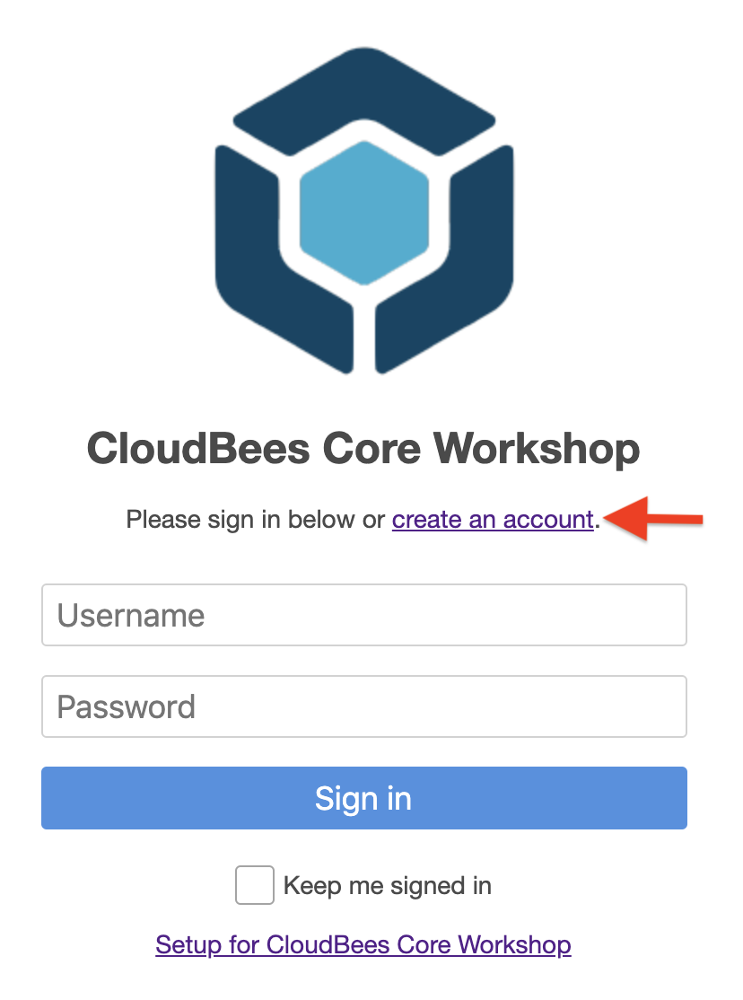
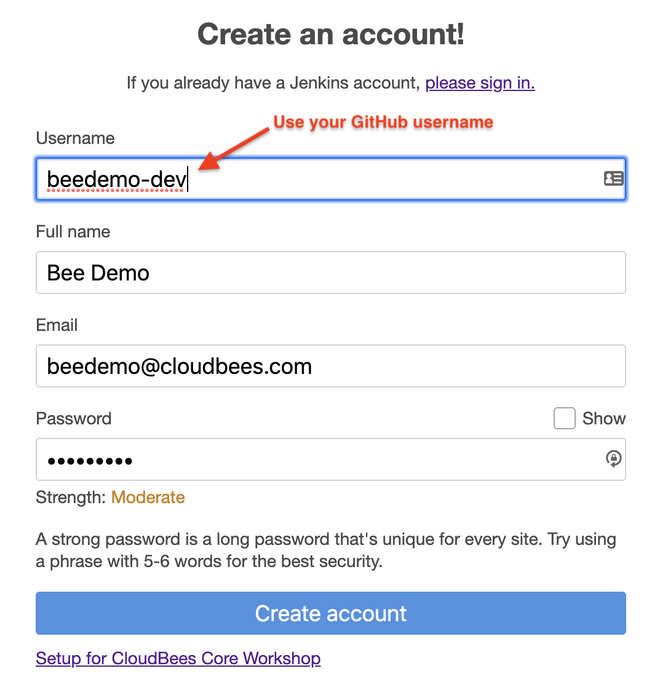
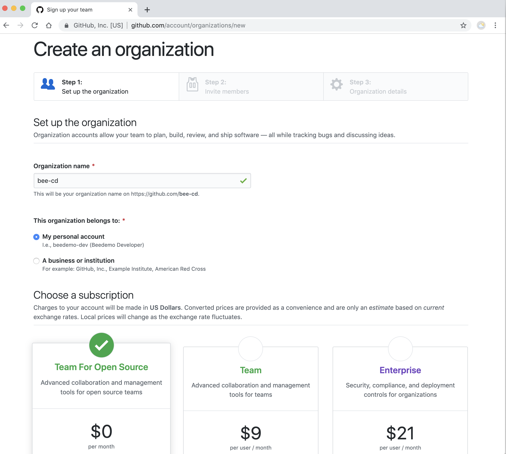

# Workshop Setup

## CloudBees Core Team Master Set-up
Setup a work environment for the lessons provided in this workshop.  Ask the instructor for the URL of the server you will be using during the workshop.

Today's URL for the CloudBees Core environment is https://workshop.cb-sa.io/cjoc/

### Create a Jenkins Account

1. Goto to the Workshop URL provided by the instructor;
2. Click on the **create an account** link in the middle above the **Username** input.

3. Complete the **Create an account!** form (all fields are required) and click the **Create account** button; **IMPORTANT: to ensure uniqueness, use {your GitHub username} as Username for Jenkins account** 

4. You should see a **Success** page - click on **the top page** link;

### Create a Team Master

Next, everyone will get their own Jenkins masters referred to as a Team Master.

1. If not in CloudBees Team UI, click on the **Teams** link in the left menu; 

2. Click on the **Create team** button in the center of your screen;

3. **Name this team** - enter a name for your team - **IMPORTANT: to ensure uniqueness, use {your GitHub username}** and then click **Next**;

4. **Choose an icon for this team** to help uniquely identify your team - select an icon and color for your team and then click **Next**;
5. **Add people to this team** - your user will show up as a **Team Admin** and we won't be adding any additional users right now, but feel free to look around and then click **Next**;
6. **Select team master creation recipe** - click on the drop-down to see the options, but select the top option: **Workshop Default** recipe;

7. Finally, click the **Create team** button. 
8. While your master is being  created (**it takes anywhere from 2-3 minutes to provision your Team Master**), move onto the next section **Create a GitHub.com user account**

## Create a GitHub.com user account
Setup a GitHub.com user account that will be used later in this workshop. If you have an existing GitHub.com account you will be able to use it if you are comfortable using that account to create a GitHub Organization later in the workshop.

1. Visit https://github.com/join and fill in the required fields to create a user account.
2. Select "Unlimited public repositories for free" when choosing your plan.
3. Verify your email account to ensure you account is activated.  An activated account will be **required** in the next few exercises.

## Create a GitHub Personal Access Token
The following instructions cover how to create a Github Personal Access Token that you will use within Jenkins to connect Pipelines, Multibranch Pipelines, and Github Organization Projects to your Github repositories.

1. Click on [this link to automatically select the required **Personal access token settings**](https://github.com/settings/tokens/new?scopes=repo,read:user,user:email,admin:repo_hook,admin:org_hook)
2. Click on **Generate Token**
3. As the success message says: **Make sure to copy your new personal access token now. You won’t be able to see it again!**  

## Create a GitHub Organization

Create a Github organization to use for this workshop:

1. On Github navigate to **Organizations**: https://github.com/settings/organizations (after logging in) 
2. Click on **New Organization** 

3. Fill in the **Organization Name**, **Billing Email**, and click on **Create Organization** - **IMPORTANT: Suggest using {your GitHub username}-devoptics as Organization Name** 

4. On the **Invite organization members** - just click the **Finish** button.

>NOTE: Even though you have to provide an email for billing, you will not be charged anything as long as you choose the free option.

## Fork the Workshop Repository

The workshop utilizes the **helloapp-nodejs** repository from the [CloudBees DWJW GitHub Organization](https://github.com/cloudbees-days). Fork the **helloapp-nodejs** and **helloapp-api** repositories into the GitHub Organization that you created above (if you are not sure how to fork a repository - see this [GitHub Guide on forking](https://guides.github.com/activities/forking/)):

* https://github.com/cloudbees-days/helloapp-api
* https://github.com/cloudbees-days/helloapp-nodejs

## Back to the Jenkins Setup

You should see the following **Create a new Pipeline** screen for your Team:

## Add GitHub Credentials to Your Team Master

We must exit the Blue Ocean UI to the Jenkins classic UI to complete the steps in this exercise.

1. Click the ***Go to classic*** button at the top of common section of Blue Ocean’s navigation bar. 

Now, we will create a **Username and password** credential using you GitHub username and personal access token. This credential will be used to configure the *GitHub Organization* project we will create and will allow the auto-setup of a GitHub Organization level webhook:

1. Navigate to the top-level of your Team Master - this should be one level-up from where you exit the Blue Ocean UI. You should see a **Manage Jenkins** link in the left navigation menu.
2. Click on the **Credentials** link in the left navigation menu. 

3. Click on the **github.com** link under **Stores scoped to Jenkins** 

4. Click on **Add Credentials** in the left menu 
 
5. Fill out the form (**Username with password**)
  - **Username**: Your GitHub user name
  - **Password**: Your GitHub personal access token [created in setup](../Setup.md#create-a-github-personal-access-token) OR [here is the GitHub link to automatically select the required **Personal access token settings** if you haven't alreaedy done it](https://github.com/settings/tokens/new?scopes=repo,read:user,user:email,admin:org_hook,delete_repo)
  - **ID**: Create an ID for your credentials (something like **github-[Your GitHub Usename]**)
  - **Description**: Can be left blank if you want 

6. Click on **OK**

## Create a GitHub Organization Folder Pipeline Project

For our labs, we are going to create a special type of Jenkins Pipeline project referred to as an [*Organization Folder*](https://jenkins.io/doc/book/pipeline/multibranch/#organization-folders) and sometimes more specifically a *GitHub Organization* project (this type of project is also [available for Bitbucket](https://plugins.jenkins.io/cloudbees-bitbucket-branch-source) and there is [unofficial support for GitLab](https://github.com/Argelbargel/gitlab-branch-source-plugin)). The Jenkins *GitHub Organization* project will scan a GitHub Organization to discover the Organization’s repositories, automatically creating **managed** [*Multibranch Pipeline* jobs](https://jenkins.io/doc/book/pipeline/multibranch/#creating-a-multibranch-pipeline) for any repository with at least one branch containing a *project recognizer* - typically **Jenkinsfile**. We will use the GitHub Organization that you created in **[Setup - Create a GitHub Organization](./Setup.md#create-a-github-organization)**. A Jenkins *GitHub Organization* project will also utilize a GitHub Organization level ***webhook it creates*** to automatically manage Jenkins jobs - both individual branch jobs and Mutlibranch Pipeline jobs associcated to repositories - when a branch or a repository is deleted from or added to the GitHub Organization.

In order to complete the following exercise you should have [forked the following repositories](./Setup.md#fork-the-workshop-repository) into the Github Organization you created in **[Setup - Create a GitHub Organization](./Setup.md#create-a-github-organization)**:

* https://github.com/cloudbees-days/helloapp-api
* https://github.com/cloudbees-days/helloapp-nodejs  

Once that repository is forked:

1. **IMPORTANT** Navigate back to the top-level of your **Team Master** and click on the folder with the same name as your **Team Master**. This is important if you want to use [Blue Ocean](https://jenkins.io/projects/blueocean/) to visualize the Pipeline runs, because only jobs under this folder will show up in Blue Ocean.
 
2. Click on **New Item** in the left navigation menu - make sure that you are in the folder with the same name as your team, and not at the root of your Team Master  

3. Enter your GitHub Organization name as the **Item Name** 
4. Select **GitHub Organization** as the item type
5. Click **Ok** 

6. Select the credentials you created above from the **Credentials** drop down 
7. Make sure that the **Owner** field matches the name of your GitHub Organization name
8. Click the **Save** button 

9. Click on the bread-crumb link to go back to your **GitHub Organization** Jenkins Pipeline project folder
10. You should now see the two forked **helloapp** repositories as Jenkins jobs! 

11. Click on **Open Blue Ocean** in the left navigation menu - to open list of jobs displayed in *Blue Ocean* UI.

12. View the pipeline jobs in *Blue Ocean* UI 
Note: We may switch between *Classic* and *Blue Ocean* UIs during the workshop, as needed - *Classic* UI would be utilized for detailed logs and administration purposes while *Blue Ocean* UI would be primarily used for viewing and running Jenkins pipelines. 

13. Verify your first sample pipeline - **{your GitHub organization}/helloapp-api**. You will notice the builds for Test and Master branch are in a *Failed* state. 

14. Select the *Branches* tab, and mouse over to display a set of icons. Click on the *play* icon to run the failed builds in the recommended order - run the *test* branch first and let it complete successfully, before running the build for *master* branch. 

15. Lets verify all branches for  *helloapp-api* are now in a successful state. 

16. Now let's verify the build status of our second sample pipeline - **{your GitHub organization}/helloapp-nodejs**. The *development* branch should be in a failed state, whereas the *master* branch should be successful state. 

17. This completes the setup for DevOptics workshop! In short time, you created your very own CloudBees Core Team (Jenkins) Master, onboarded a few sample multi-branch pipelines and did basic walk through to get more comfortable navigating the CloudBees Core / Jenkins Master UI! 
18. Now, let's login to CloudBees DevOptics to gain quick insight, capture real-time metrics & visibility into our sample, interdependent pipelines...

## Login to CloudBees DevOptics

Go to https://devoptics.cloudbees.com in your browser and login with the email **beedemo.guest@gmail.com** and the password provided by your instructor 

You may proceed to the next set of [**labs**](./README.md#workshop-labs) - once you have successfully completed the setup.