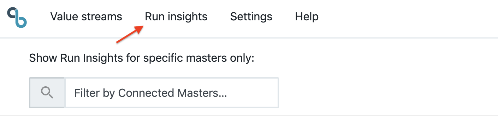
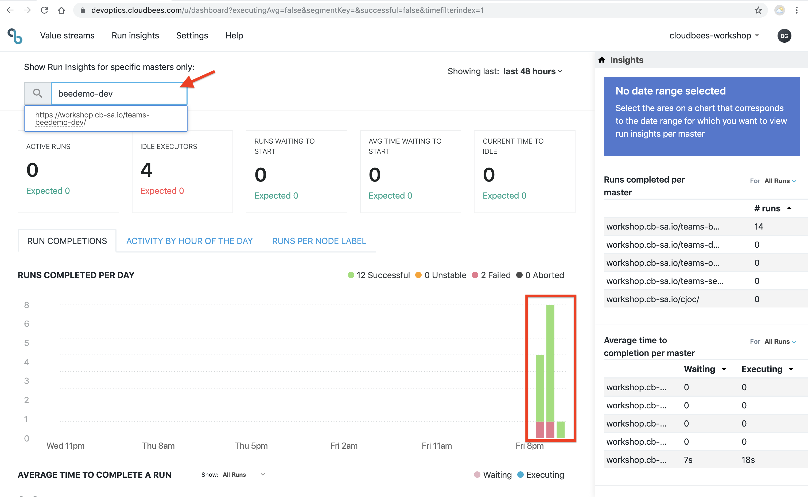

# Platform monitoring using DevOptics Run Insights

[DevOptics Run Insights](https://go.cloudbees.com/docs/cloudbees-documentation/devoptics-user-guide/run_insights/) provides CD Platform monitoring and helps shared services teams improve DevOps performance by exposing infrastructure inefficiencies, allowing automation constraints to be uncovered and removed. It provides you with insights into:

* Server workloads
* Job and pipeline activity
* Details of idle time - how much and when
* Number of runs waiting to start
* Length of build request queues
* Run completion and their status - successful, failed, etc.
* Optimal time for maintenance/upgrades

## Take a Tour of DevOptics Run Insights
Run insights provide you with a real-time and historical view of job and pipeline activity. You can connect any number of masters for an aggregate view across the organization. Masters can be a heterogeneous mix of CloudBees Core and Jenkins. Metrics are viewable over an adjustable time period.

Click on Run Insights in the top navbar to switch view 

## Filter by Team Master
Run Insights lets you filter the shown data per master or group of masters to understand activity and performance of one or more specific masters.

* You can filter by one or multiple connected masters.
* You can remove specific masters from the filtered master list or clear all.
* It stores the filter setting in your local storage, to persist the filter when you return.

1. The initial view will show you insights for all Jenkins Masters that are connected to the ***cloudbees-dwjw*** organization. To filter by your Team Master search for your Team Master name in the **Filter by Connected Masters...** search input and select your Team Master from the list 

2. Now you will only see the insights only for your Team Master. 

To learn more about DevOptics Run Insights refer to [CloudBees' Run Insights documentation](https://go.cloudbees.com/docs/cloudbees-documentation/devoptics-user-guide/run_insights/).

You've reached the end of the CloudBees DevOptics workshop! Click here to head back to the main list of [**labs**](./README.md#workshop-labs).

You may also check out the other labs offered by us here: [CloudBees Days Workshop](https://github.com/cloudbees-days).
