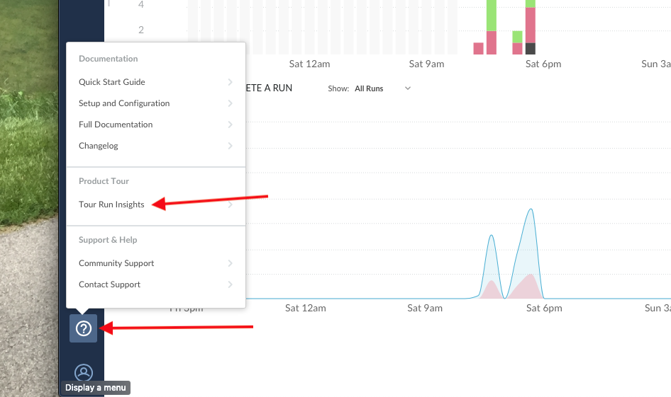
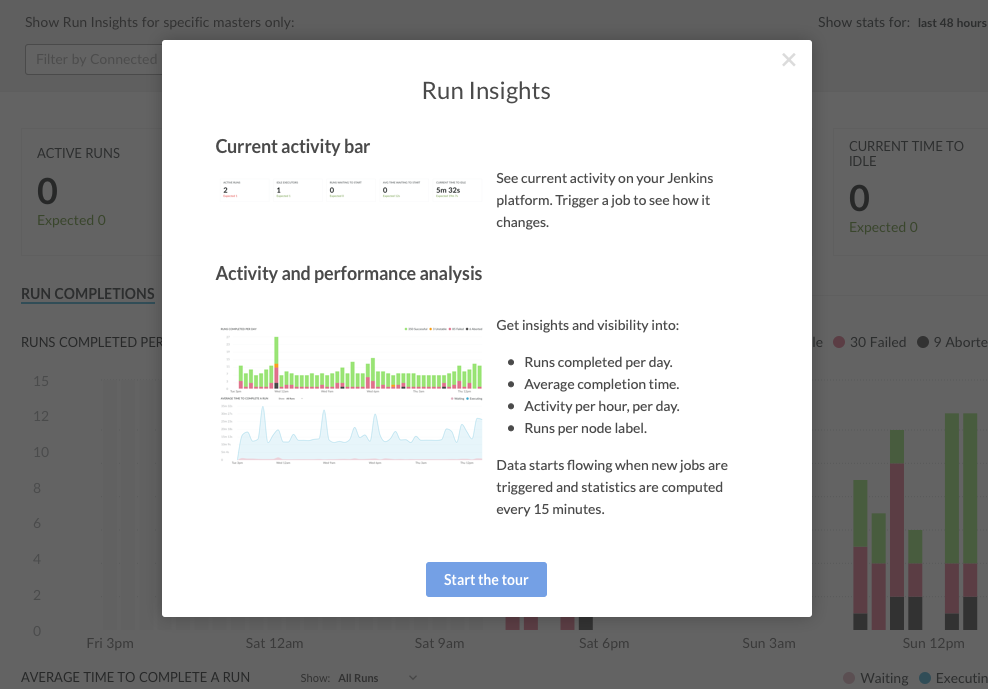

# DevOptics Run Insights
[DevOptics Run Insights](https://go.cloudbees.com/docs/cloudbees-documentation/devoptics-user-guide/run_insights/ target="_blank") provides CD Platform monitoring and helps shared services teams improve DevOps performance by exposing infrastructure inefficiencies, allowing automation constraints to be uncovered and removed. It provides you with insights into:

* Server workloads
* Job and pipeline activity
* Details of idle time - how much and when
* Number of runs waiting to start
* Length of build request queues
* Run completion and their status - successful, failed, etc.
* Optimal time for maintenance/upgrades

## Take a Tour of DevOptics Run Insights
1. Go to https://devoptics.cloudbees.com in your browser and login with the email **beedemo.guest@gmail.com** and the password provided by your instructor 

2. Click on the graph icon in the left menu to switch to the Run Insights view 

3. Next click on the **?** left menu item and then select **Tour Run Insights** from the pop-up menu 

4. Complete the tour and then continue to the next exercise 

## Filter by Team Master
Run Insights lets you filter the shown data per master or group of masters to understand activity and performance of one or more specific masters.

* You can filter by one or multiple connected masters.
* You can remove specific masters from the filtered master list or clear all.
* It stores the filter setting in your local storage, to persist the filter when you return.

1. The initial view will show you insights for all Jenkins Masters that are connected to the ***cloudbees-days*** account. To filter by your Team Master search for your Team Master name in the **Filter by Connected Masters...** search input and select your Team Master from the list 

2. Now you will only see the insights only for your Team Master. 

To learn more about DevOptics Run Insights refer to [CloudBees' Run Insights documentation](https://go.cloudbees.com/docs/cloudbees-documentation/devoptics-user-guide/run_insights/).

The next DevOptics feature that we will look at is [DevOptics Value Streams](https://go.cloudbees.com/docs/cloudbees-documentation/devoptics-user-guide/value_streams/), but before we do that we are going quickly create an end-to-end CI/CD Pipeline for your fork of the cloudbees-day/helloworld-nodejs repository with a [CloudBees Core Pipeline Catalog Template](./catalog-templates.md).

