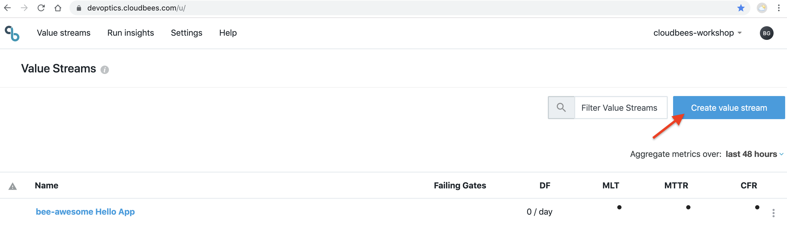

# Value Stream as Code using JSON Editor

In addition to the Visual Editor, DevOptics also provides a JSON editor. The JSON editor is only available to update a Value Stream created by the Visual Editor not create one. The following example will walk you through creating another value stream using the JSON editor that encompasses two separate repositories (services).

1. Go back to DevOptics in your browser and switch to the **Value Streams** view and click on the **Create New** button in the upper right corner <p> This will open the [**Value Stream Visual Editor**](https://go.cloudbees.com/docs/cloudbees-documentation/devoptics-user-guide/value_streams/#devoptics-visual-editor)
2. Click on the default title in the upper-left and change the title to be **{your GitHub username} Hello App**, hit return and then click the **Save** button in the upper-left to save the Value Stream<p>
3. Next, click on the the 3 vertical dots next to the ***Edit*** button and select **Edit JSON** from the menu <p>
4. Delete the **Value Stream JSON** content and replace with the following, replacing all occurences of **{your GitHub username}**, both for the `master` value and the `job` value, in the JSON with your GitHub username and ***{your GitHub Org name}*** with the GitHub Organization you are using for this workshop:
```
{
	"phases": [
		{
			"id": "TSlZ0sqDuh",
			"name": "Build",
			"gates": [
				{
					"id": "5eMvajavv",
					"name": "API Dev",
					"master": "https://workshop.cb-sa.io/teams-{your GitHub username}/",
					"job": "{your GitHub username}/{your GitHub Org name}/helloapp-api/development",
					"feeds": "v-4fcgpTY",
					"fanout": []
				},
				{
					"id": "ZF5Ou-7vv",
					"name": "UI Dev ",
					"master": "https://workshop.cb-sa.io/teams-{your GitHub username}/",
					"job": "{your GitHub username}/{your GitHub Org name}/helloapp-nodejs/development",
					"feeds": "release",
					"fanout": []
				}
			]
		},
		{
			"id": "QLggEt9hI",
			"name": "Test",
			"gates": [
				{
					"id": "v-4fcgpTY",
					"name": "API Test",
					"master": "https://workshop.cb-sa.io/teams-{your GitHub username}/",
					"job": "{your GitHub username}/{your GitHub Org name}/helloapp-api/test",
					"feeds": "yiK5MUR5Q",
					"fanout": []
				}
			]
		},
		{
			"id": "ExwDnpexcA",
			"name": "Deploy API",
			"gates": [
				{
					"id": "yiK5MUR5Q",
					"name": "API Master",
					"master": "https://workshop.cb-sa.io/teams-{your GitHub username}/",
					"job": "{your GitHub username}/{your GitHub Org name}/helloapp-api/master",
					"feeds": "release",
					"fanout": [],
					"type": "deployment"
				}
			]
		},
		{
			"id": "8THbC9EXqX",
			"name": "Deploy App",
			"gates": [
				{
					"id": "release",
					"name": "UI Master",
					"master": "https://workshop.cb-sa.io/teams-{your GitHub username}/",
					"job": "{your GitHub username}/{your GitHub Org name}/helloapp-nodejs/master",
					"fanout": [],
					"type": "deployment",
					"feeds": null
				}
			]
		}
	]
}
```
5. Click the **Save changes** button <p>
6. You will have a new Value Stream <p>.

### The **helloapp-nodejs** Application

The **helloapp-nodejs** application is a simple NodeJS app that serves a simple index page with a message. 

If you navigate to **helloapp-nodejs** in your Jenkins master, you'll notice that there are two stages, a `Web Tests` stage used to test the NodeJS app using a selenium sandbox which runs on the `development` branch and a `Build and Push Image` stage that runs on `master`. <p>

The `UI Dev` gate of the value stream represents the `development` branch of the **helloapp-nodejs** app. The `Web Tests` stage tests whether the hosted nodejs app shows a body of `Hello World!`, spelled correctly. The current state of the app has an error (the body shows `Hello Worlld`) that we will fix in the next few steps. <p>

### Fixing the **helloapp-nodejs** Application

1. In DevOptics you should see that the **UI Dev** gate has failed due to the error mentioned above. <p>
2. Open the GitHub editor for the `hello.js` file in the **development** branch of your forked **helloapp-nodejs** repository, on line 13 fix the misspelled ***Worlld***   
```
res.render('index', { title: 'Hello', message: 'Hello World!', 
```
3. Commit the change to the **development** branch with the commit message ***UI-1001 fixed misspelling*** <p>
4. Now your job should complete successfully and the **UI Dev** gate should show that it finished successfully - what is your MTTR for the **UI Dev** gate? What is the MTTR for the entire Value Stream?  <p>
5. Now that you have fixed your **helloapp-nodejs** application it is time to merge to the **master** branch and deploy. Create a [Pull Request](https://help.github.com/en/articles/creating-a-pull-request) between the **development** branch and **master** branch of your forked **helloapp-nodejs** repository. 
6. Changed the **base repository** to the **master** branch of your forked **helloapp-nodejs** repository (not the **cloudbees-dwjw** repository), add a comment and then click the **Create pull request** button <p>
7. A job will be created for the pull request and once it has completed successfully your pull request will show that **All checks have passed**. Go ahead and click the **Merge pull request** button and then click the **Confirm merge** button but DO NOT delete the **development** branch <p>
8. In your DevOptics Value Stream you should see the **UI-1001** ticket move from the **UI Dev** gate to the **UI Master** gate. What is your deployment frequency? <p>

The next DevOptics feature that we will look at is [DevOptics Run Insights](./insights.md).