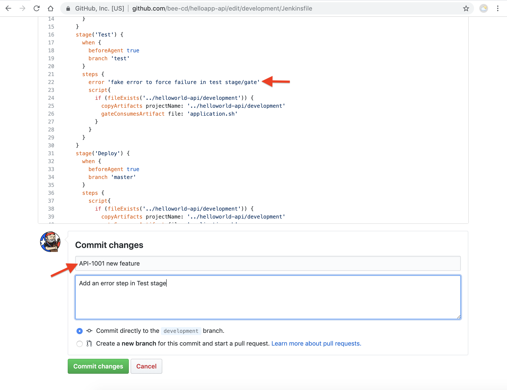
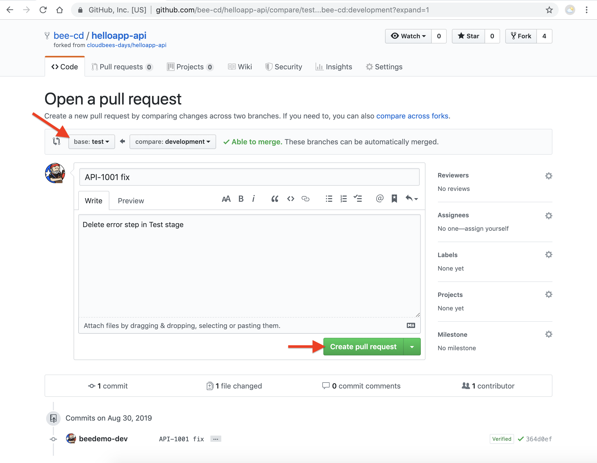

# Measure DevOps performance with Value Streams

Now that you have an initial Value Stream, we will commit a number of changes to your fork of the  ***helloapp-api*** repository to simulate [DevOptics Performance metrics](https://go.cloudbees.com/docs/cloudbees-documentation/devoptics-user-guide/value_streams/#_devops_performance_metrics).

1. Navigate to and open the GitHub editor for the `Jenkinsfile` file in **development** branch of your forked **helloapp-api** repository <p>
2. Update the Jenkinsfile to fail in the `Test` stage by adding the following `error` step
```
        error 'fake error to force failure in test stage/gate'
``` 
3. Commit the change to your **development** branch with a commit message of: **API-1001 new feature**  <p>
4. Once the job for your **development** branch completes, switch to your DevOptics Value Streams window and you should see the **development branch** gate updated to show that it has 1 ticket in it and that it completed successfully<p>
5. Now we will create a [Pull Request](https://help.github.com/en/articles/creating-a-pull-request) between the **development** branch and **test** branch of your forked **helloapp-api** repository. Navigate to your forked **helloapp-api** repository in GitHub - click on the **New pull request** button
6. Change the **base repository** to the **test** branch of your forked **helloapp-api** repository (not the **cloudbees-dwjw** repository), add a comment and then click the **Create pull request** button <p>
7. Click the **Merge pull request** button and then click the **Confirm merge** button but **DO NOT delete the development branch**
8. Switch to your DevOptics Value Streams window and you should eventually see the **test branch** gate updated to show that it has 1 ticket in it and that it failed<p>
9. Delete the `error` step from the `Test` stage on the **development** branch of your fork of the  ***helloapp-api*** repository and commit the change to the **development** branch with the following commit message: **API-1001 fix**
10. Create another [Pull Request](https://help.github.com/en/articles/creating-a-pull-request) between the **development** branch and **test** branch of your forked **helloapp-api** repository. Navigate to your forked **helloapp-api** repository in GitHub - click on the **New pull request** button
11. Change the **base repository** to the **test** branch of your forked **helloapp-api** repository (not the **cloudbees-dwjw** repository), add a comment and then click the **Create pull request** button <p>
12. Click the **Merge pull request** button and then click the **Confirm merge** button but **DO NOT delete the development branch**
13. Switch to your DevOptics Value Streams window and you should eventually see the **test branch** gate updated to show that it has 1 ticket in it and that it is successful. Note the *Change Failure Rate* and the *Mean Time To Recovery* of the **test gate**<p>
14. So now we are ready to merge to the **master** branch and release. Create another [Pull Request](https://help.github.com/en/articles/creating-a-pull-request) between the **test** branch and **master** branch of your forked **helloapp-api** repository. Navigate to your forked **helloapp-api** repository on the **test** branch in GitHub - click on the **New pull request** button<p>
15. Change the **base repository** to the **master** branch of your forked **helloapp-api** repository (not the **cloudbees-dwjw** repository), add a comment and then click the **Create pull request** button
16. Click the **Merge pull request** button and then click the **Confirm merge** button but **DO NOT delete the test branch**
17. Switch to your DevOptics Value Streams window and you should eventually see the **master branch** gate updated to show that it has 1 ticket in it and that it is successful<p>
18. Next, click on the **test branch** gate and you will now have gate metics for *Mean Lead Time*, *Deployment Frequency*, *Change Failure Rate*, *Mean Processing Time* and *Mean Time to Recovery*.<p>
19. Next, click on the *chevron* icon to switch to view the metrics for the entire value stream as opposed to just the **test gate**<p>

You may proceed to the next lab [*Lab 3. Value Streams as Code*](./value-streams-as-code.md) or head back to the main list of the [**labs**](./README.md#workshop-labs) when you are ready.

