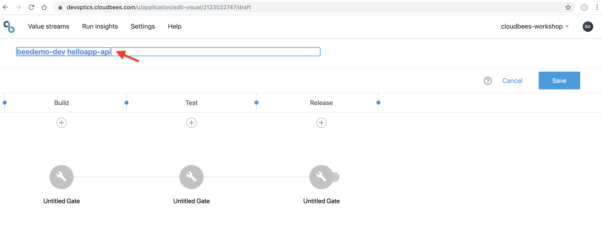

# DevOptics Value Streams
A CloudBees DevOptics Value Stream models a complex continuous delivery process and can be assembled from multiple pipelines. A Value Stream shows a series of interconnected gates or steps that deliver value to a customer. Those steps are presented in the "Value Stream view". The Value Stream view allows you to:

* Track changes
* Detect stalled and delayed changes
* Identify failures and blockages
* Find components ready for testing
* View contributing components

## Value Stream Editor
DevOptics visual editor lets you model different phases and gates of your value stream.

* Phases - the milestones or stages used to deliver the software
* Gates - the Jenkins pipeline that is run to move the code change forward (e.g. build, test, deploy, …​)

Once modeled you can instrument your Jenkins Pipelines from the CloudBees Core Pipeline Workshop so DevOptics is able to track tickets and commits flowing through the value stream end to end.

1. Go back to DevOptics in your browser and switch to the **Value Streams** view and click on the **Create New** button in the upper right corner 
 This will open the [**Value Stream Visual Editor**](https://go.cloudbees.com/docs/cloudbees-documentation/devoptics-user-guide/value_streams/#devoptics-visual-editor)
2. Click on the default title in the upper-left and change the title to be **{your GitHub username} helloworld-api** and hit return 

3. Next click on the **Untitled Gate** below the **Build** phase and then clikc on the **cog** to configure the gate 

4. Fill out the gate configuration form:
  - **Username**: Your GitHub user name
  - **Password**: Your GitHub personal access token [created in setup](../Setup.md#create-a-github-personal-access-token) OR [here is the GitHub link to automatically select the required **Personal access token settings** if you haven't alreaedy done it](https://github.com/settings/tokens/new?scopes=repo,read:user,user:email,admin:repo_hook)
  - **ID**: Create an ID for your credentials (something like **yourorg-github-token**)
  - **Description**: Can be left blank if you want

### Value Stream Mapping for Microservices
Using the two applications that we created Pipelines for in the CloudBees Core Pipelines Workshop we show how you can use DevOptics Value Streams to map the software delivery process of loosely coupled microservices as separated streams as part of a holistic value stream