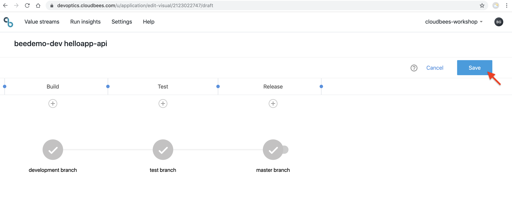
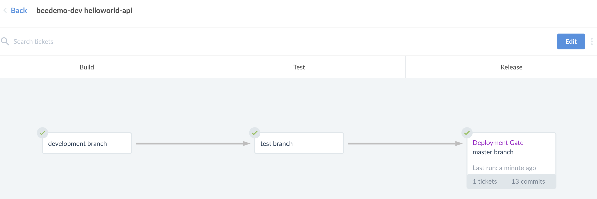

# DevOptics Value Streams
A CloudBees DevOptics Value Stream models a complex continuous delivery process and can be assembled from multiple pipelines. A Value Stream shows a series of interconnected gates or steps that deliver value to a customer. Those steps are presented in the "Value Stream view". The Value Stream view allows you to:

* Track changes
* Detect stalled and delayed changes
* Identify failures and blockages
* Find components ready for testing
* View contributing components

## Value Stream Mapping for Microservices
Using the two applications used in the [CloudBees Core Pipeline Workshop](https://github.com/cloudbees-days/cloudbees-core-workshop), we will show how you can use DevOptics Value Streams to map the software delivery process of loosely coupled microservices as separated streams as part of a holistic value stream.

### Fork the **helloworld-api** repository.
The workshop utilizes the **helloworld-api** repository from the [CloudBees Days GitHub Organization](https://github.com/cloudbees-days). Fork the **helloworld-api** repository into the [GitHub Organization that you created for the workshops](https://github.com/cloudbees-days/cloudbees-core-workshop/blob/master/Setup.md#create-a-github-organization) (if you are not sure how to fork a repository - see this [GitHub Guide on forking](https://guides.github.com/activities/forking/)):

* https://github.com/cloudbees-days/helloworld-api

### Value Stream Visual Editor
DevOptics visual editor lets you model different phases and gates of your value stream.

* Phases - the milestones or stages used to deliver the software
* Gates - the Jenkins pipeline that is run to move the code change forward (e.g. build, test, deploy, …​)

Once modeled you can instrument the Jenkins Pipelines from the CloudBees Core Pipeline Workshop so DevOptics is able to track tickets and commits flowing through the value stream end to end.

1. Go back to DevOptics in your browser and switch to the **Value Streams** view and click on the **Create New** button in the upper right corner to open open the [**Value Stream Visual Editor**](https://go.cloudbees.com/docs/cloudbees-documentation/devoptics-user-guide/value_streams/#devoptics-visual-editor)<p>
2. Click on the default title in the upper-left and change the title to be **{your GitHub username} helloworld-api** and hit return <p>
3. Next click on the **Untitled Gate** below the **Build** phase and then click on the **cog** to configure the gate <p>
4. Fill out the gate configuration form - **IMPORTANT:** Replace ***{your GitHub username}*** with your GitHub username/Team Master name and replace ***{GitHub Org name}*** with your GitHub Organization name you are usign for this workshop:
  - **Gate Name**: development branch
  - **Master**: https://cje.workshop.beedemo.net/teams-{your GitHub username}/
  - **Job**: {your GitHub username}/{GitHub Org name}/helloworld-api/development
  - **Phase**: Build
  - leave the other fields as is <p>
  - **Save** the form
5. Click on the **Untitled Gate** below the **Test** phase, then click on the **cog** to configure the gate and fill out the gate configuration form:
  - **Gate Name**: test branch
  - **Master**: https://cje.workshop.beedemo.net/teams-{your GitHub username}/
  - **Job**: {your GitHub username}/{GitHub Org name}/helloworld-api/test
  - **Phase**: Test
  - leave the other fields as is 
  - **Save** the form
6. Click on the **Untitled Gate** below the **Release** phase, then click on the **cog** to configure the gate and fill out the gate configuration form:
  - **Gate Name**: master branch
  - **Master**: https://cje.workshop.beedemo.net/teams-{your GitHub username}/
  - **Job**: {your GitHub username}/{GitHub Org name}/helloworld-api/master
  - **Phase**: Release
  - Check the **This is a deployment job** checkbox <p>
  - **Save** the form
7. Click on the **Save** button in the upper-left to save the Value Stream <p>

### DevOptics Performance Metrics
Now that you have an initial Value Stream, we will commit a number of changes to your fork of the  ***helloworld-api*** repository to simulate [DevOptics Performance metrics](https://go.cloudbees.com/docs/cloudbees-documentation/devoptics-user-guide/value_streams/#_devops_performance_metrics).

1. Navigate to and open the GitHub editor for the `Jenkinsfile` file in **development** branch of your forked **helloworld-api** repository
2. Update the Jenkinsfile to fail in the `Test` stage by adding the following `error` step
```
        error 'fake error to force failure in test stage/gate'
```
3. Commit the change to your **development** branch with a commit message of: **API-1001 new feature** 
4. Once the job for your **development** branch completes, switch to your DevOptics Value Streams window and you should see the **development branch** gate updated to show that it has 1 ticket in it and that it completed successfully<p>
5. Now we will create a [Pull Request](https://help.github.com/en/articles/creating-a-pull-request) between the **development** branch and **test** branch of your forked **helloworld-api** repository. Navigate to your forked **helloworld-api** repository in GitHub - click on the **New pull request** button
6. Change the **base repository** to the **test** branch of your forked **helloworld-api** repository (not the **cloudbees-days** repository), add a comment and then click the **Create pull request** button
7. Click the **Merge pull request** button and then click the **Confirm merge** button but **DO NOT delete the development branch**
8. Switch to your DevOptics Value Streams window and you should eventually see the **test branch** gate updated to show that it has 1 ticket in it and that it failed<p>
9. Delete the `error` step from the `Test` stage on the **development** branch of your fork of the  ***helloworld-api*** repository and commit the change to the **development** branch with the following commit message: **API-1001 fix**
10. Create another [Pull Request](https://help.github.com/en/articles/creating-a-pull-request) between the **development** branch and **test** branch of your forked **helloworld-api** repository. Navigate to your forked **helloworld-api** repository in GitHub - click on the **New pull request** button
11. Change the **base repository** to the **test** branch of your forked **helloworld-api** repository (not the **cloudbees-days** repository), add a comment and then click the **Create pull request** button
12. Click the **Merge pull request** button and then click the **Confirm merge** button but **DO NOT delete the development branch**
13. Switch to your DevOptics Value Streams window and you should eventually see the **test branch** gate updated to show that it has 1 ticket in it and that it is successful. Note the *Change Failure Rate* and the *Mean Time To Recovery* of the **test gate**<p>
14. So now we are ready to merge to the **master** branch and release. Create another [Pull Request](https://help.github.com/en/articles/creating-a-pull-request) between the **test** branch and **master** branch of your forked **helloworld-api** repository. Navigate to your forked **helloworld-api** repository on the **test** branch in GitHub - click on the **New pull request** button<p>
15. Change the **base repository** to the **master** branch of your forked **helloworld-api** repository (not the **cloudbees-days** repository), add a comment and then click the **Create pull request** button
16. Click the **Merge pull request** button and then click the **Confirm merge** button but **DO NOT delete the test branch**
17. Switch to your DevOptics Value Streams window and you should eventually see the **master branch** gate updated to show that it has 1 ticket in it and that it is successful<p>
18. Next, click on the **master branch** gate and you will now have gate metics for *Mean Lead Time*, *Deployment Frequency*, *Mean Queue Time* and *Mean Processing Time*.<p>
19. Next, click on the *chevron* icon to switch to view the metrics for the entire value stream as opposed to jsut the **master gate**<p>

### Value Stream JSON Editor

In addition to the Visual Editor, DevOptics also provides a JSON editor. The JSON editor is only available to update a Value Stream created by the Visual Editor not create one.

1. Go back to DevOptics in your browser and switch to the **Value Streams** view and click on the **Create New** button in the upper right corner <p> This will open the [**Value Stream Visual Editor**](https://go.cloudbees.com/docs/cloudbees-documentation/devoptics-user-guide/value_streams/#devoptics-visual-editor)
2. Click on the default title in the upper-left and change the title to be **{your GitHub username} Hello App**, hit return and then click the **Save** button in the upper-left to save the Value Stream<p>
3. Next, click on the the 3 vertical dots next to the ***Seach by Ticket Id*** and select **Edit JSON** from the menu <p>
4. Delete the **Value Stream JSON** content and replace with the following, replacing all occurences of **{your GitHub username}**, both for the `master` value and the `job` value, in the JSON with your GitHub username and ***{GitHub Org name}*** with the GitHub Organization you are using for this workshop:
```
{
	"phases": [
		{
			"id": "TSlZ0sqDuh",
			"name": "Build",
			"gates": [
				{
					"id": "5eMvajavv",
					"name": "API Dev",
					"master": "https://cje.workshop.beedemo.net/teams-{your GitHub username}/",
					"job": "{your GitHub username}/{GitHub Org name}/helloworld-api/development",
					"feeds": "v-4fcgpTY"
				},
				{
					"id": "ZF5Ou-7vv",
					"name": "UI Dev ",
					"master": "https://cje.workshop.beedemo.net/teams-{your GitHub username}/",
					"job": "{your GitHub username}/{GitHub Org name}/helloworld-nodejs/development",
					"feeds": "release"
				}
			]
		},
		{
			"name": "Test",
			"id": "QLggEt9hI",
			"gates": [
				{
					"id": "v-4fcgpTY",
					"name": "API Test",
					"master": "https://cje.workshop.beedemo.net/teams-{your GitHub username}/",
					"job": "{your GitHub username}/{GitHub Org name}/helloworld-api/test",
					"feeds": "yiK5MUR5Q"
				}
			]
		},
		{
			"name": "Deploy API",
			"id": "ExwDnpexcA",
			"gates": [
				{
					"id": "yiK5MUR5Q",
					"name": "API Master",
					"master": "https://cje.workshop.beedemo.net/teams-{your GitHub username}/",
					"job": "{your GitHub username}/{GitHub Org name}/helloworld-api/master",
					"feeds": "release",
					"type": "deployment"
				}
			]
		},
		{
			"name": "Deploy App",
			"id": "8THbC9EXqX",
			"gates": [
				{
					"id": "release",
					"name": "UI Master",
					"master": "https://cje.workshop.beedemo.net/teams-{your GitHub username}/",
					"job": "{your GitHub username}/{GitHub Org name}/helloworld-nodejs/master",
					"type": "deployment",
					"feeds": null
				}
			]
		}
	]
}
```
5. Click the **Save changes** button <p>
6. You will have a new Value Stream and the **API Master** gate should already have tickets in it <p>

### Fix Your **helloworld-nodejs** Application

Before you fix your fork of the **helloworld-nodejs** repostiory we will run it again by making a simple change and commiting it on your **development** branch. 

1. Open the GitHub editor for the `Jenkinsfile` file in the **development** branch of your forked **helloworld-nodejs** repository, add the following `library 'cb-days@master'` for a shared librare above the `pipeline` block and then replace the **Test** `stage` with the following **Web Tests** stage and then commit the change to the **development** branch with the commit message ***UI-1001 still broken***
```
stage('Web Tests') {
      agent {
        kubernetes {
          label 'nodejs-testcafe'
          yamlFile 'nodejs-pod.yaml'
        }
      }
      when {
        beforeAgent true
        branch 'development'
      }
      stages {
        stage('Nodejs Setup') {
          steps {
            checkout scm
            defineProps('.nodejs-app', [npmPackages: 'express pug'])            
            container('nodejs') {
              sh """
                npm i -S ${npmPackages}
                node ./hello.js &
              """
            }
          }   
        }
        stage('Testcafe') {
          steps {
            container('testcafe') {
              sh '/opt/testcafe/docker/testcafe-docker.sh "chromium --no-sandbox" tests/*.js -r xunit:res.xml'
            }
          }   
        }
      }  
      post {
        success {
          stash name: 'app', includes: '*.js, public/**, views/*, Dockerfile'
        }
        always {
          junit 'res.xml'
        }
      } 
    }
```
2. Once again, your **helloworld-nodejs** Multibranch **development** job should run and fail and in DevOptics you should see that the **UI Dev** gate has 1 ticket in it and that it failed
3. Now we will fix your app. Open the GitHub editor for the `hello.js` file in the **development** branch of your forked **helloworld-nodejs** repository, on line 13 fix the misspelled ***Worlld*** and then commit the change to the **development** branch with the commit message ***UI-1001 fixed misspelling***
4. Now your job should complete successfully and the **UI Dev** gate should show that it finished successfully - what is your MTTR for the **UI Dev** gate? What is the MTTR for the entire Value Stream?
5. Now that you have fixed your **helloworld-nodejs** application it is time to merge to the **master** branch and deploy. Create a [Pull Request](https://help.github.com/en/articles/creating-a-pull-request) between the **development** branch and **master** branch of your forked **helloworld-nodejs** repository. 
6. Changed the **base repository** to the **master** branch of your forked **helloworld-nodejs** repository (not the **cloudbees-days** repository), add a comment and then click the **Create pull request** button 
7. A job will be created for the pull request and once it has completed successfully your pull request will show that **All checks have passed**. Go ahead and click the **Merge pull request** button and then click the **Confirm merge** button but DO NOT delete the **development** branch
8. In your DevOptics Value Stream you should see the **UI-1001** ticket move from the **UI Dev** gate to the **UI Master** gate. What is your deployment frequency?

