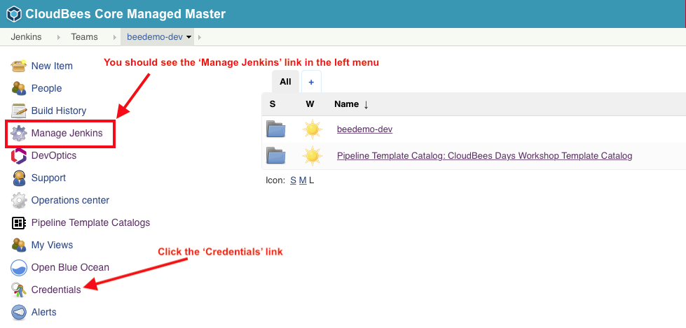
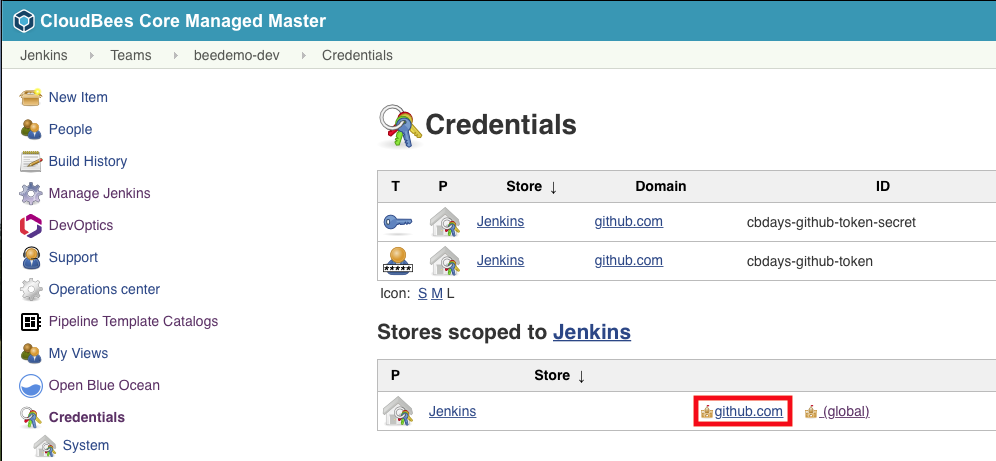
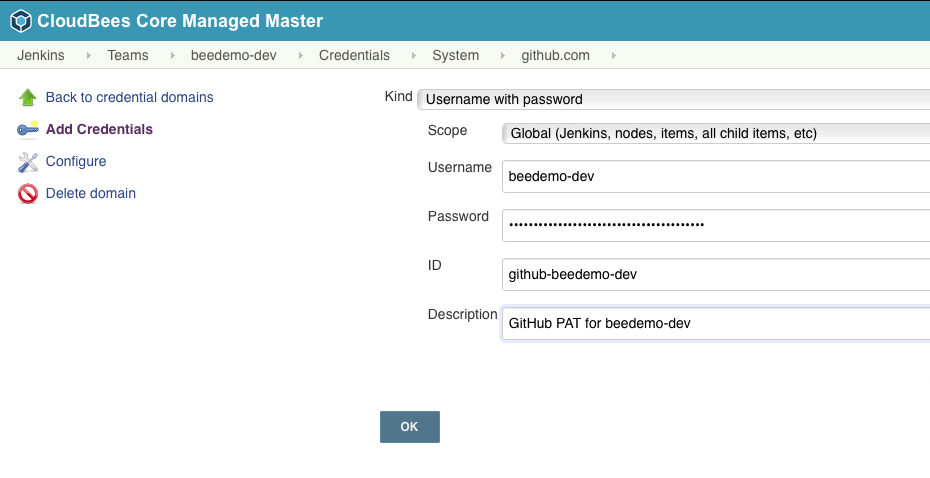
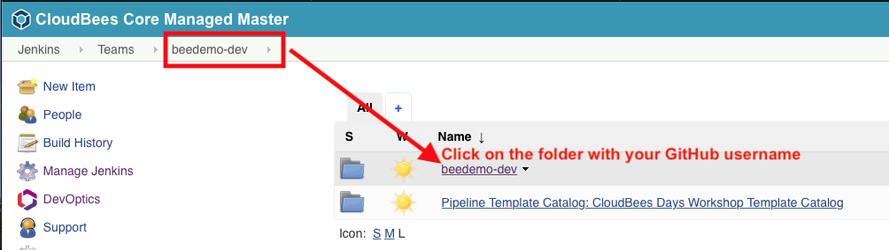
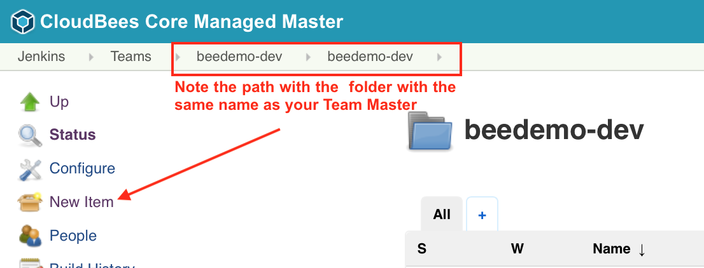
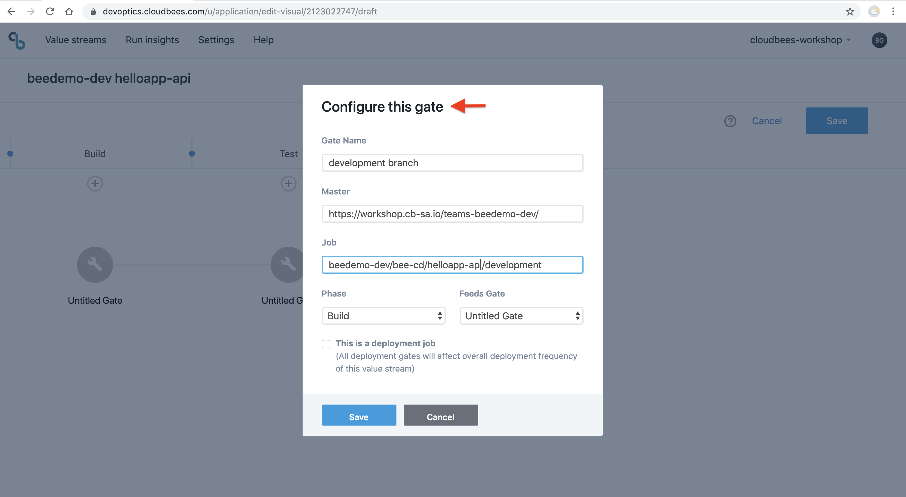

# Introduction to Value Streams using CloudBees DevOptics

A CloudBees DevOptics Value Stream models a complex continuous delivery process and can be assembled from multiple pipelines. A Value Stream shows a series of interconnected gates or steps that deliver value to a customer. Those steps are presented in the "Value Stream view". The Value Stream view allows you to:

* Track changes
* Detect stalled and delayed changes
* Identify failures and blockages
* Find components ready for testing
* View contributing components

### Value Stream Visual Editor
DevOptics visual editor lets you model different phases and gates of your value stream.

* Phases - the milestones or stages used to deliver the software
* Gates - the Jenkins pipeline that is run to move the code change forward (e.g. build, test, deploy, …​)

Once modeled you can instrument the Jenkins Pipelines from the CloudBees Core Pipeline Workshop so DevOptics is able to track tickets and commits flowing through the value stream end to end.

## Add GitHub Credentials to Your Team Master

We must exit the Blue Ocean UI to the Jenkins classic UI to complete the steps in this exercise.

1. Click the ***Go to classic*** button at the top of common section of Blue Ocean’s navigation bar. 

Now, we will create a **Username and password** credential using you GitHub username and personal access token. This credential will be used to configure the *GitHub Organization* project we will create and will allow the auto-setup of a GitHub Organization level webhook:

1. Navigate to the top-level of your Team Master - this should be one level-up from where you exit the Blue Ocean UI. You should see a **Manage Jenkins** link in the left navigation menu.
2. Click on the **Credentials** link in the left navigation menu. 

3. Click on the **github.com** link under **Stores scoped to Jenkins** 

4. Click on **Add Credentials** in the left menu 
 
5. Fill out the form (**Username with password**)
  - **Username**: Your GitHub user name
  - **Password**: Your GitHub personal access token [created in setup](../Setup.md#create-a-github-personal-access-token) OR [here is the GitHub link to automatically select the required **Personal access token settings** if you haven't alreaedy done it](https://github.com/settings/tokens/new?scopes=repo,read:user,user:email,admin:org_hook,delete_repo)
  - **ID**: Create an ID for your credentials (something like **github-[Your GitHub Usename]**)
  - **Description**: Can be left blank if you want 

6. Click on **OK**

## Create a GitHub Organization Folder Pipeline Project

For our labs, we are going to create a special type of Jenkins Pipeline project referred to as an [*Organization Folder*](https://jenkins.io/doc/book/pipeline/multibranch/#organization-folders) and sometimes more specifically a *GitHub Organization* project (this type of project is also [available for Bitbucket](https://plugins.jenkins.io/cloudbees-bitbucket-branch-source) and there is [unofficial support for GitLab](https://github.com/Argelbargel/gitlab-branch-source-plugin)). The Jenkins *GitHub Organization* project will scan a GitHub Organization to discover the Organization’s repositories, automatically creating **managed** [*Multibranch Pipeline* jobs](https://jenkins.io/doc/book/pipeline/multibranch/#creating-a-multibranch-pipeline) for any repository with at least one branch containing a *project recognizer* - typically **Jenkinsfile**. We will use the GitHub Organization that you created in **[Setup - Create a GitHub Organization](./Setup.md#create-a-github-organization)**. A Jenkins *GitHub Organization* project will also utilize a GitHub Organization level ***webhook it creates*** to automatically manage Jenkins jobs - both individual branch jobs and Mutlibranch Pipeline jobs associcated to repositories - when a branch or a repository is deleted from or added to the GitHub Organization.

In order to complete the following exercise you should have [forked the following repositories](./Setup.md#fork-the-workshop-repository) into the Github Organization you created in **[Setup - Create a GitHub Organization](./Setup.md#create-a-github-organization)**:

* https://github.com/cloudbees-days/helloapp-api
* https://github.com/cloudbees-days/helloapp-nodejs  

Once that repository is forked:

1. **IMPORTANT** Navigate back to the top-level of your **Team Master** and click on the folder with the same name as your **Team Master**. This is important if you want to use [Blue Ocean](https://jenkins.io/projects/blueocean/) to visualize the Pipeline runs, because only jobs under this folder will show up in Blue Ocean.
 
2. Click on **New Item** in the left navigation menu - make sure that you are in the folder with the same name as your team, and not at the root of your Team Master  

3. Enter your GitHub Organization name as the **Item Name** 
4. Select **GitHub Organization** as the item type
5. Click **Ok** 

6. Select the credentials you created above from the **Credentials** drop down 
7. Make sure that the **Owner** field matches the name of your GitHub Organization name
8. Click the **Save** button 

9. Click on the bread-crumb link to go back to your **GitHub Organization** Jenkins Pipeline project folder
10. You should now see the two forked **helloapp** repositories as Jenkins jobs! 

11. Click on **Open Blue Ocean** in the left navigation menu - to open list of jobs displayed in *Blue Ocean* UI.

12. View the pipeline jobs in *Blue Ocean* UI 
Note: We may switch between *Classic* and *Blue Ocean* UIs during the workshop, as needed - *Classic* UI would be utilized for detailed logs and administration purposes while *Blue Ocean* UI would be primarily used for viewing and running Jenkins pipelines. 

13. Verify your first sample pipeline - **{your GitHub organization}/helloapp-api**. You will notice the builds for Test and Master branch are in a *Failed* state. 

14. Select the *Branches* tab, and mouse over to display a set of icons. Click on the *play* icon to run the failed builds in the recommended order - run the *test* branch first and let it complete successfully, before running the build for *master* branch. 

15. Lets verify all branches for  *helloapp-api* are now in a successful state. 

16. Now let's verify the build status of our second sample pipeline - **{your GitHub organization}/helloapp-nodejs**. The *development* branch should be in a failed state, whereas the *master* branch should be successful state. 

17. This completes the setup for DevOptics workshop! In short time, you created your very own CloudBees Core Team (Jenkins) Master, onboarded a few sample multi-branch pipelines and did basic walk through to get more comfortable navigating the CloudBees Core / Jenkins Master UI! 
18. Now, let's login to CloudBees DevOptics to gain quick insight, capture real-time metrics & visibility into our sample, interdependent pipelines...

## Login to CloudBees DevOptics

Go to https://devoptics.cloudbees.com in your browser and login with the email **beedemo.guest@gmail.com** and the password provided by your instructor 

1. Switch to the **Value Streams** view and click on the **Create value stream** button to open the [**Value Stream Visual Editor**](https://go.cloudbees.com/docs/cloudbees-documentation/devoptics-user-guide/value_streams/#devoptics-visual-editor)

2. Click on the default title in the upper-left and change the title to be **{your GitHub username} helloapp-api** and hit return 

3. Next click on the **Untitled Gate** below the **Build** phase and then click on the **cog** to configure the gate 

4. Fill out the gate configuration form - **IMPORTANT:** Replace ***{your GitHub username}*** with your GitHub username/Team Master name and replace ***{your GitHub Org name}*** with your GitHub Organization name you are usign for this workshop:
  - **Gate Name**: development branch
  - **Master**: https://workshop.cb-sa.io/teams-{your GitHub username}/
  - **Job**: {your GitHub username}/{your GitHub Org name}/helloapp-api/development
  - **Phase**: Build
  - leave the other fields as is 

  - **Save** the form
5. Click on the **Untitled Gate** below the **Test** phase, then click on the **cog** to configure the gate and fill out the gate configuration form:
  - **Gate Name**: test branch
  - **Master**: https://workshop.cb-sa.io/teams-{your GitHub username}/
  - **Job**: {your GitHub username}/{your GitHub Org name}/helloapp-api/test
  - **Phase**: Test
  - leave the other fields as is 
  - **Save** the form
6. Click on the **Untitled Gate** below the **Release** phase, then click on the **cog** to configure the gate and fill out the gate configuration form:
  - **Gate Name**: master branch
  - **Master**: https://workshop.cb-sa.io/teams-{your GitHub username}/
  - **Job**: {your GitHub username}/{your GitHub Org name}/helloapp-api/master
  - **Phase**: Release
  - Check the **This is a deployment job** checkbox 

  - **Save** the form
7. Click on the **Save** button to save the Value Stream 

8. Done! Your DevOptics Value Stream is ready for review. 

You may proceed to the next lab [*Lab 2. Measure DevOps performance with Value Streams*](./value-streams-measurement.md) or head back to the main list of the [**labs**](./README.md#workshop-labs) when you are ready.